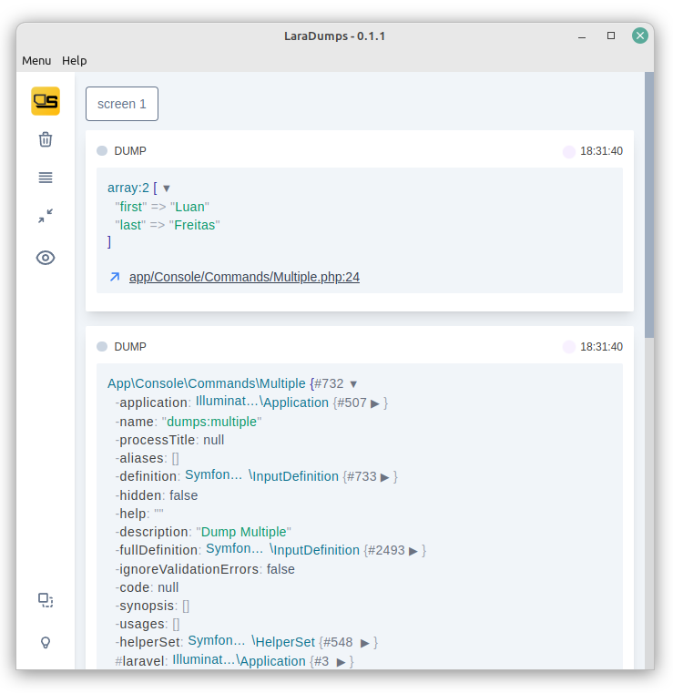
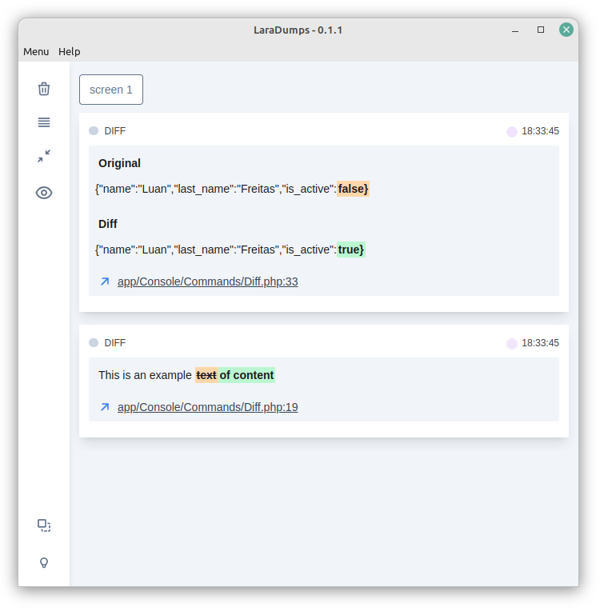
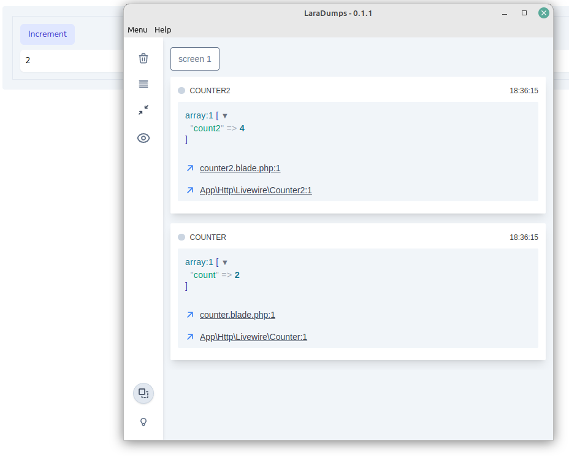

<p align="center">
  
</p>
<h1 align="center">LaraDumps</h1>
<div align="center">
  <br>
  <sub>Available for Windows, Linux and macOS.</sub>
</div>
<br>
<div align="center">
  <a href="https://github.com/laradumps/app/releases/latest">
    
  </a>
  <a href="https://github.com/laradumps/app/releases">
    
  </a>
</div>
<div align="center">
  <h3> 
    <a href="https://laradumps.gitbook.io/get-started/">
      📚 Documentation
    </a>
    <span> | </span>
    <a href="https://github.com/laradumps/laradumps#contribution">
      ⌨️ Contribution
    </a>
  </h3>
</div>

# What is LaraDumps?

> LaraDumps is an app designed to boost your Laravel PHP coding and debugging experience. Dumps was inspired by [Spatie Ray](https://github.com/spatie/ray), check it out!.

* This project is free and open source, supports only applications built with Laravel Framework.

#### Tech Stack

* [Electron](https://www.electronjs.org/)

#### Renderer

* VanillaJS
* [AlpineJS](https://alpinejs.dev/)
* [TailwindCSS](https://tailwindcss.com/)

## Here's an example:

```php
ds('Hello world');

ds(['a' => 1, 'b' => 2])->danger();

ds('multiple', 'arguments', $foo, $bar);

ds()->queriesOn('label');

User::firstWhere('email', 'you@email.com');

ds()->queriesOff();

ds()->die(); 
```

### Multiple

<div align="center">



</div>
--- 

### Diff

<div align="center">



</div>

---

### Livewire

<div align="center">



</div>

---

And also with the blade directive:

> See full documentation

```blade
<div>
    @foreach($array as $key => $value)
        @ds($key, $value);
    @endforeach
</div>  
```

### Credits

- Logo by [Vitor S. Rodrigues](https://twitter.com/V1t0rSOuz4)
